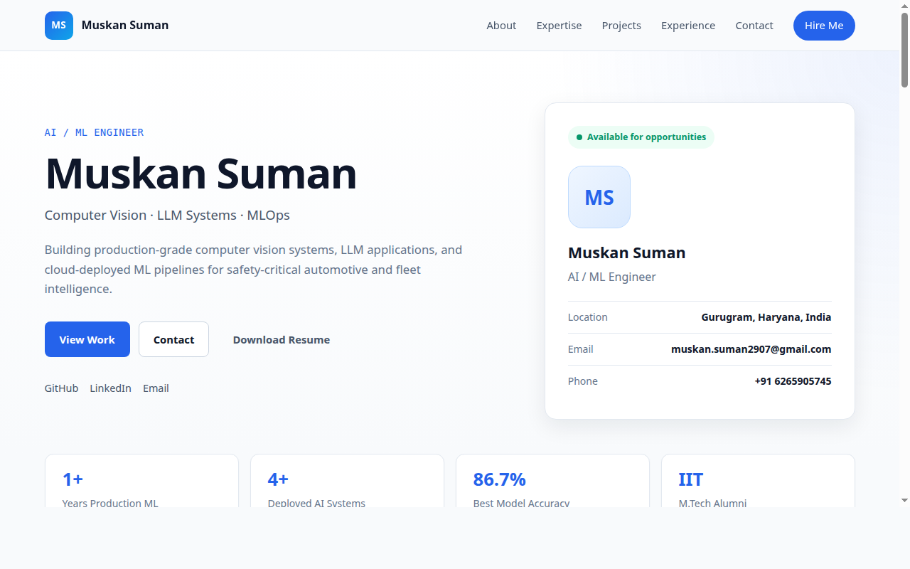

# Hi, I'm Muskan Suman 👋
### AI / ML Engineer · Computer Vision · LLM Systems

---

## 🌐 Portfolio Website

  <a href="https://muskansuman.vercel.app/"><strong>🔗 View Live Portfolio →</strong></a>

---

## 🧠 About Me

> AI/ML Engineer with **1+ year of production experience** building computer vision systems, LLM-powered applications, and cloud-deployed ML pipelines.

- 🎓 **M.Tech** from **IIT Jodhpur** — Robotics & Mobility Systems (CGPA: 7.89)
- 🏢 Currently at **Novus Hi-Tech**, Gurugram — building ADAS and Fleet AI systems
- 🔭 Passionate about the full ML lifecycle: data → training → deployment → inference
- 📍 Based in **Gurugram, Haryana, India**

---

## 🛠️ Tech Stack

**Languages**

**AI / ML**

**GenAI & LLMs**

**MLOps & Cloud**

---

## 🚀 What I've Built at Novus Hi-Tech

### 🤖 Fleet-GPT — AI-Driven Fleet Management Assistant
RAG pipeline with **AWS Bedrock + pgvector + Aurora PostgreSQL** enabling real-time querying of structured/unstructured fleet data. Multi-agent orchestration with semantic retrieval and dynamic tool calling.

### 🚗 Driver-Monitoring False-Alert Reduction Pipeline
Production ADAS pipeline using **YOLOv11 + YOLOv11-Pose + FastAPI + AWS Lambda** to re-validate safety events (phone use, drowsiness, smoking, FCW, lane departure) for commercial fleets. Multi-stage inference with temporal filtering.

### 😴 Drowsy Disambiguator — Driver Drowsiness Detection
Designed **DBDNet** — a 1D-CNN + Multi-Head Self-Attention (~13K params). Achieved **86.7% accuracy, 0.90 F1, 0.99 ROC-AUC**. Improved heavy-drowsy retention **33% → 100%** over previous baseline.

### 🖼️ Synthetic Data Generation & Domain Adaptation
Diffusion-based image synthesis pipeline + CLIP embeddings + PCA + TF-IDF to analyze synthetic-to-real distribution shifts for computer vision training.

---

## 📂 Featured Projects

| Project | Description | Stack |
|---|---|---|
| [🚗 Car Price Prediction LLM](https://github.com/Muskansuman) | Conversational used-car price predictor with LLM query understanding | scikit-learn, Groq, Gemini, FastAPI, Redis, Streamlit |
| [📍 Object Tracking via Homography](https://github.com/Muskansuman/OBJECT-TRAKING-BY-USING-HOMOGRAPHY-AND-POSE-ESTIMATION) | 6-DoF pose recovery for cross-frame localisation | OpenCV, Python |
| [🤖 Obstacle Avoidance Path Planning](https://github.com/Muskansuman/Obstacle-Avoidance-Path-Planning-Static-Environment) | RL agent navigation in static environments | Python, RL |
| [🧠 Lightweight Semantic Segmentation](https://github.com/Muskansuman) | MobileNet + spatial attention + atrous convolutions for edge deploy | PyTorch |
| [🚙 Holonomic Vehicle Control](https://github.com/Muskansuman/CONTROL-OF-A-HOLONOMIC-VEHICLE-USING-ULTRASONIC-SENSOR) | Mecanum wheel control via STM32 + ultrasonic sensor | C, STM32 |

---

## 🎓 Education

| Degree | Institution | Year | CGPA |
|---|---|---|---|
| M.Tech — Robotics & Mobility Systems | **IIT Jodhpur** | 2023–2025 | 7.89/10 |
| B.Tech — Aeronautical Engineering | Nitte Meenakshi Institute of Technology | 2018–2022 | 8.55/10 |

> 📄 **M.Tech Thesis**: *Vibration Estimation in Autonomous Vehicles Using IMU Data* — applied EMD, VMD, and Hilbert Transform for road-induced vibration frequency analysis.

---

💬 *Open to AI/ML opportunities in Computer Vision, LLM Systems, and MLOps*

📧 [muskan.suman2907@gmail.com](mailto:muskan.suman2907@gmail.com) · 📱 +91 6265905745

